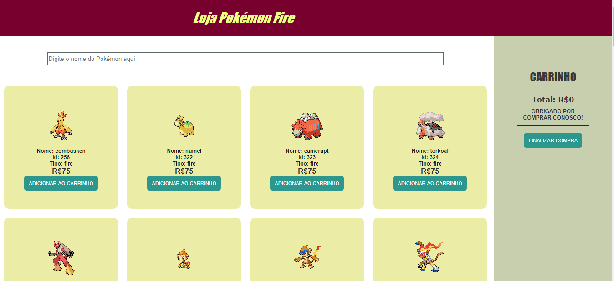
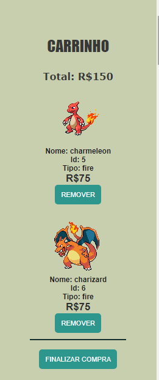
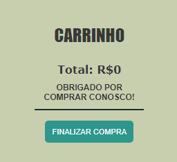
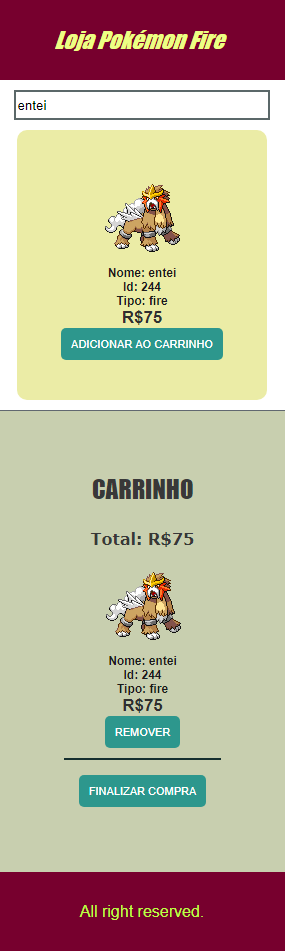

# Loja Pokemon Fire
Este projeto é um e-commerce que consome api de pokémon por meio do endereço "https://pokeapi.co/api/v2/pokemon/". Os produtos são exibidos conforme extração feita da api. 
As principais tecnologias utilizadas são ReactJs com hooks, TypeScript e NodeJs.  

O projeto pode ser acessado pelo link a seguir: <a href="https://pokemon-fire-ecommerce.web.app/" target="_blank">Pokémon Fire</a>.  
Essa é a tela inicial do projeto com os pokémon e seus respectivos valores, um campo de busca e um carrinho de produtos ao lado.  
Só existem Pokémon do tipo fire nessa loja. 

   

Abaixo constam os produtos no carrinho com botão para remoção e no final um botão para finalizar a compra. 
Na parte superior o valor total é calculado. Após clicar em finalizar, um agradecimento é exibido.  

Na versão responsiva, o carrinho foi movido para a parte inferior:  

